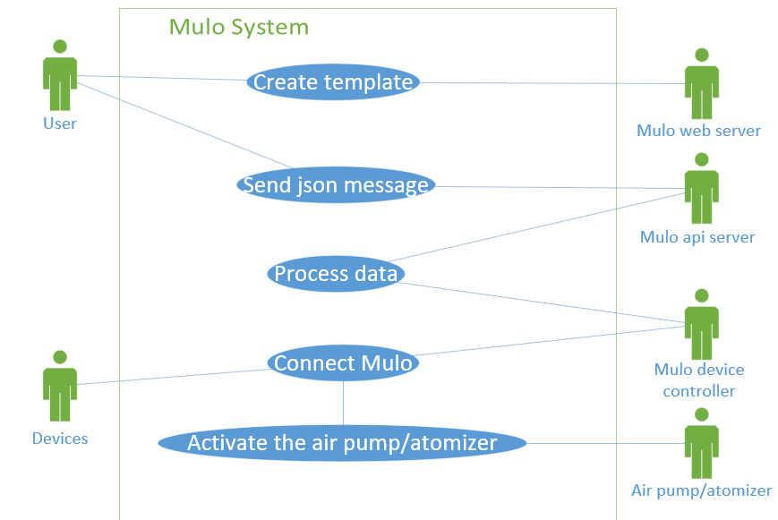
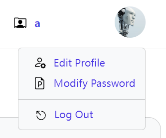
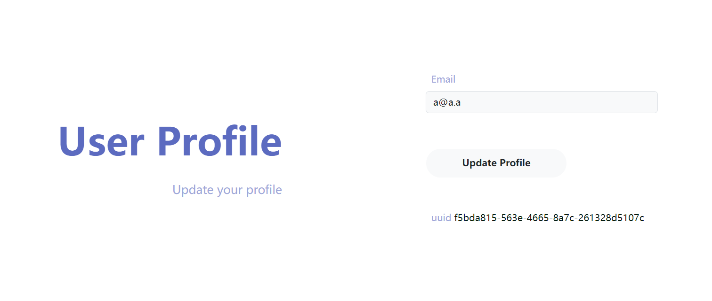

# Welcome to Mulo sever!

## Basic Mode Details Handling

### 1. Parameter Introduction

- **Input device**: The name of the input device (the scope is equivalent to the labels created by Role).
- **Role number**: The number of input devices that trigger an event (how many devices will trigger an event).
- **Time window**: The sliding time window (within how much time must events occur to trigger the final event).
- **Output device**: The name of the output device (the scope is equivalent to the labels created by Role).
- **Port**: The port number for playing scents.
- **Duration**: The duration of scent playback.

### 2. Detailed Requirements

1. **Adjustable Time Window**: The time window is adjustable as a sliding scale.

2. **Backend System Development**: The backend system can allows users to define these parameters themselves (backend trigger conditions).
   - **Example**: During an online class, if n students click "Confused" within x seconds, the teacher's end will play a specific scent for m seconds.

3. **Input Device Reception**: The input device can receive messages from users (consider integrating user inputs with the system).

4. **Device Management**: In the device management section, user data needs to be bound to their roles.

<div style="text-align: center;">



**Figure 1**: the structure of Mulo sever

</div>

## Interaction logic

To Trigger an Odor Playback Event, You Need to Send a POST Request to the Server.

**URL**:
```plaintext
http://127.0.0.1:8000/api/event/
```

**Request Body**:
```json
{
    "uuid": "f5bda815-563e-4665-8a7c-261328d5107c",
    "event": "Event_1"
}
```

You can obtain the uuid in several places:

1. **The Edit Profile Webpage**

   After logging in and clicking on your avatar, enter the edit profile interface to find your uuid.

<div style="text-align: center;">

   

   **Figure 2**: <http://localhost:8000/admin/main/>

   

   **Figure 3**: <http://localhost:8000/home/profile/>

</div>

### 2. Via getuuid API

You can send a POST request to `/api/uuid/` to obtain the UUID. Here is an example of the JSON payload:

```json
{
    "username": "a",
    "password": "a"
}
```

The request should be:
```json
{
    "request": "/api/uuid/",
    "error_code": "0",
    "error": "Success",
    "uuid": "f5bda815-563e-4665-8a7c-261328d5107c"
}
```

## Clients

### 1. Unity Client

Unity uses the C# language and can be accessed through the built-in `JsonUtility` class or third-party libraries such as Newtonsoft JSON to parse and serialize JSON data.

Here is an example for sending a JSON request to the Unity JSON event API:

```c#
using System.Collections;
using UnityEngine;
using UnityEngine.Networking;

public class JsonRequestExample : MonoBehaviour
{
    IEnumerator Start()
    {
        // Create a UnityWebRequest object, specifying the URL and method
        string url = "http://localhost:8000/api/event";
        UnityWebRequest request = new UnityWebRequest(url, "POST");

        // Prepare the JSON data to be sent
        string jsonData = "{\"event\":\"Event_1\",\"key2\":\"f5bda815-563e-4665-8a7c-261328d5107c\"}";

        // Set the JSON data in the request body
        byte[] jsonToSend = new System.Text.UTF8Encoding().GetBytes(jsonData);
        request.uploadHandler = new UploadHandlerRaw(jsonToSend);
        request.SetRequestHeader("Content-Type", "application/json");

        // Set up the handler for receiving the response data
        request.downloadHandler = new DownloadHandlerBuffer();

        // Send the request
        yield return request.SendWebRequest();

        // Check if the request was successful
        if (request.result == UnityWebRequest.Result.Success)
        {
            Debug.Log("Response: " + request.downloadHandler.text);
        }
        else
        {
            Debug.LogError("Error: " + request.error);
        }
    }
}
```

### 2. Unreal Engine Client

In Unreal Engine, you can use the built-in network request function or third-party plugins to send JSON requests. Here is an example of using Unreal Engine's HTTP request feature to send JSON requests.

```c++
// OdorJsonSender.h
#pragma once

#include "CoreMinimal.h"
#include "Kismet/BlueprintFunctionLibrary.h"
#include "OdorJsonSender.generated.h"

UCLASS()
class ODORMAP_API UOdorJsonSender : public UBlueprintFunctionLibrary
{
	GENERATED_BODY()
	UFUNCTION(BlueprintPure, Category = "OdorJson")
	static int SendJson(FString URL, FString UUID, FString Event);
};
```

```c++
// OdorJsonSender.cpp
#include "OdorJsonSender.h"
#include "HttpModule.h"
#include "Interfaces/IHttpRequest.h"
#include "Interfaces/IHttpResponse.h"
#include "Json.h"

int UOdorJsonSender::SendJson(FString URL, FString UUID, FString Event)
{
    // Create JSON payload
    FString PostData = FString::Printf(TEXT(R"({"uuid": "%s", "event": "%s"})"), *UUID, *Event);

    // Create HTTP request
    TSharedRef&lt;IHttpRequest&gt; HttpRequest = FHttpModule::Get().CreateRequest();
    HttpRequest-&gt;SetURL(URL);
    HttpRequest-&gt;SetVerb(TEXT("POST"));
    HttpRequest-&gt;SetHeader(TEXT("Content-Type"), TEXT("application/json"));
    HttpRequest-&gt;SetContentAsString(PostData);
    
    // Send the request and handle response
    HttpRequest-&gt;OnProcessRequestComplete().BindLambda(
        [](FHttpRequestPtr Request, FHttpResponsePtr Response, bool bWasSuccessful)
        {
            if (bWasSuccessful && Response.IsValid())
            {
                // Extract error_code from the JSON response
                FString ResponseContent = Response-&gt;GetContentAsString();
                TSharedPtr&lt;FJsonObject&gt; JsonObject;
                TSharedRef&lt;TJsonReader&lt;&gt;&gt; JsonReader = TJsonReaderFactory&lt;&gt;::Create(ResponseContent);

                if (FJsonSerializer::Deserialize(JsonReader, JsonObject) && JsonObject.IsValid())
                {
                    FString ErrorCode = JsonObject-&gt;GetStringField(TEXT("error_code"));
                    // Log the error_code
                    UE_LOG(LogTemp, Log, TEXT("Error Code: %s"), *ErrorCode);
                }
                else
                {
                    UE_LOG(LogTemp, Warning, TEXT("Failed to parse JSON response."));
                }
            }
            else
            {
                UE_LOG(LogTemp, Error, TEXT("Request failed or response is invalid."));
            }
        });

    // Send the request
    if (HttpRequest-&gt;ProcessRequest())
    {
        return 0; // Return 0 on success
    }

    return -1; // Return -1 on failure
}
```

### 3. Python Client

For python client, the example code is shown below:
```python
import requests

url = "http://127.0.0.1:8000/api/event/"

# Enter your uuid and eventID, here is an example
data = {
    "uuid": "f5bda815-563e-4665-8a7c-261328d5107c",
    "event": "Event_1"
}
response = requests.post(url, json=data)

if response.status_code == 200:
    print("POST request successful!")
    print("Response:", response.text)
else:
    print("POST request failed. Status code:", response.status_code)
```

### APIs
#### 1. `LoginView`
- **Request**: POST `/api/login/`
- Request body:
```json
{
"username": "string",
"password": "string"
}
```
- **Response**:
- Success:
```json
{
"request": "/api/login/",
"error_code": "0",
"error": "Success"
}
```
- Failure:
```json
{
"request": "/api/login/",
"error_code": "10008",
"error": "Param error, see doc for more info"
}
```
```json
{
"request": "/api/login/",
"error_code": "21302",
"error": "Username or password error"
}
```


#### 2. `GetUuidView`
- **Request**: POST `/api/uuid/`
- Request body:
```json
{
"username": "string",
"password": "string"
}
```
- **Response**:
- Success:
```json
{
"request": "/api/uuid/",
"error_code": "0",
"error": "Success",
"uuid": "string"
}
```
- Failure:
```json
{
"request": "/api/uuid/",
"error_code": "10008",
"error": "Param error, see doc for more info",
"uuid": ""
}
```
```json
{
"request": "/api/uuid/",
"error_code": "21302",
"error": "Username or password error",
"uuid": ""
}
```


#### 3. `RegView`
- **Request**: POST `/api/reg/`
- Request body:
```json
{
"username": "string",
"password": "string",
"email": "string"
}
```
- **Response**:
- Success:
```json
{
"request": "/api/reg/",
"error_code": "0",
"error": "Success"
}
```
- Failure:
```json
{
"request": "/api/reg/",
"error_code": "10008",
"error": "Param error, see doc for more info"
}
```
```json
{
"request": "/api/reg/",
"error_code": "21110",
"error": "The username has been used"
}
```


#### 4. `LogoutView`
- **Request**: POST `/api/logout/`
- Request body: None
- **Response**:
- Success:
```json
{
"request": "/api/logout/",
"error_code": "0",
"error": "Success"
}
```
- Failure:
```json
{
"request": "/api/logout/",
"error_code": "10001",
"error": "System error"
}
```


#### 5. `EventView`
- **Request**: POST `/api/event/`
- Request body:
```json
{
"uuid": "string",
"event": "string"
}
```
- **Response**:
- Success:
```json
{
"request": "/api/event/",
"error_code": "0",
"error": "Success"
}
```
- Failure:
```json
{
"request": "/api/event/",
"error_code": "10008",
"error": "Param error, see doc for more info"
}
```
```json
{
"request": "/api/event/",
"error_code": "21124",
"error": "Wrong uuid code"
}
```
```json
{
"request": "/api/event/",
"error_code": "21125",
"error": "Cannot find the template"
}
```


#### 6. `DateView`
- **Request**: POST `/api/date/`
- Request body: None
- **Response**:
- Success:
```json
{
"request": "datetime.datetime.now()"
}
```


#### 7. `ClearView`
- **Request**: POST `/api/clear/`
- Request body:
```json
{
"username": "string",
"password": "string",
"type": "string"
}
```
- **Response**:
- Success:
```json
{
"request": "/api/clear/",
"error_code": "0",
"error": "Success"
}
```
- Failure:
```json
{
"request": "/api/clear/",
"error_code": "10008",
"error": "Param error, see doc for more info"
}
```
```json
{
"request": "/api/clear/",
"error_code": "21302",
"error": "Username or password error"
}
```


#### 8. `TemplateView`
- **Request**: POST `/api/template/`
- Request body:
```json
{
"event_name": "string",
"uuid": "string",
"role_num": "number",
"time_window": "number",
"input_device": "number",
"output_device": "number",
"port": "number",
"duration": "number",
"pwm": "number"
}
```
- **Response**:
- Success:
```json
{
"request": "/api/template/",
"error_code": "0",
"error": "Success"
}
```
- Failure:
```json
{
"request": "/api/template/",
"error_code": "20001",
"error": "Invalid uuid"
}
```
```json
{
"request": "/api/template/",
"error_code": "30001",
"error": "Invalid input_device or output_device ID"
}
```
```json
{
"request": "/api/template/",
"error_code": "10008",
"error": "Param error, see doc for more info"
}
```


#### 9. `GetOdorList`
- **Request**: GET `/api/odorlist/`
- **Response**:
- Success:
```json
{
"status": true,
"data": [
{
"id": "number",
"odor": "string"
}
]
}
```


#### 10. `SaveTemplateOdors`
- **Request**: POST `/api/savetemplateodors/`
- Request body:
```json
{
"tid": "string",
"odors": [
{
"odor_id": "string",
"port_id": "string",
"start": "number",
"duration": "number",
"intensity": "number"
}
]
}
```
- **Response**:
- Success:
```json
{
"status": true
}
```


#### 11. `GetTemplateOdorsByTid`
- **Request**: GET `/api/gettemplateodorsbytid/?tid=string`
- **Response**:
- Success:
```json
{
"status": true,
"data": [
{
"id": "number",
"odor_id": "string",
"port_id": "string",
"start": "number",
"duration": "number",
"intensity": "number"
}
]
}
```


#### 12. `SetTemplateParent`
- **Request**: POST `/api/settemplateparent/`
- Request body:
```json
{
"tid": "string",
"pid": "string"
}
```
- **Response**:
- Success:
```json
{
"status": true
}
```


#### 13. `GetSubTemplatesByTid`
- **Request**: GET `/api/getsubtemplatesbytid/?tid=string`
- **Response**:
- Success:
```json
{
"status": true,
"data": [
{
"id": "number",
"event_name": "string",
"uuid": "string",
"role_num": "number",
"time_window": "number",
"input_device": "number",
"output_device": "string",
"port": "number",
"duration": "number",
"pwm": "number"
}
]
}
```


#### 14. `GetValidWhileParentByTid`
- **Request**: GET `/api/getvalidwhileparentbytid/?tid=string`
- **Response**:
- Success:
```json
{
"status": true,
"data": "boolean"
}
```


#### 15. `SaveTemplateValidWhileParent`
- **Request**: POST `/api/savetemplatevalidwhileparent/`
- Request body:
```json
{
"tid": "string",
"valid_while_parent": "boolean"
}
```
- **Response**:
- Success:
```json
{
"status": true
}
```
